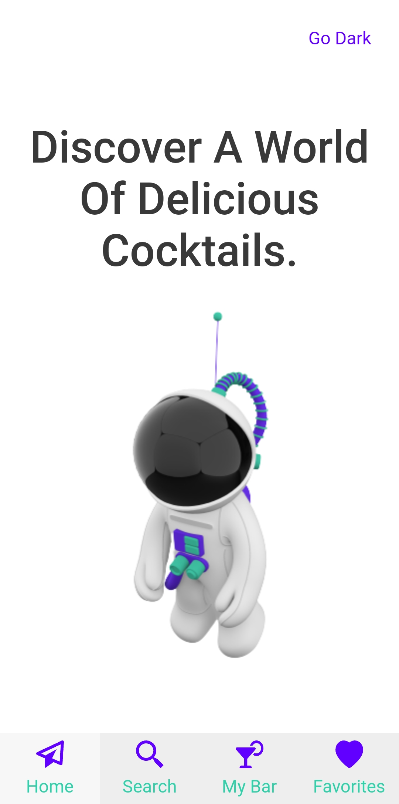
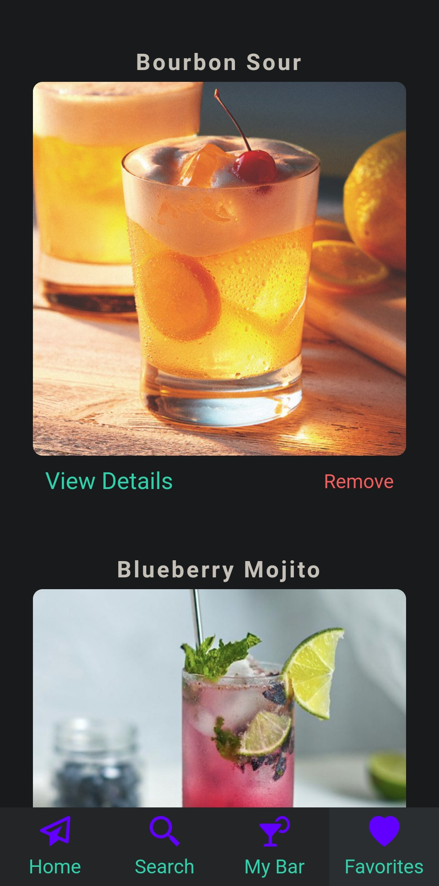

# Cocktail Hour
##### *[Click Here](https://cocktailhour.kurtisgarcia.dev) for live site*
The purpose of this project is to allow users to search for different cocktails within TheCocktailDB API database in addition to viewing the step by step recipe allowing the user the ability to create that cocktail on their own.

### How To Use

- ##### *Home page:*

    - Astronaut has nothing to do with cocktails, but I thought he looked cool 😆. 

- ##### *Search page:*

    - Search for different cocktails by name.
    - If you can't remember the full cocktail name, search part of the cocktail name and you will be able to find the cocktail you were looking for.
    - View cocktail recipe by clicking "View Details" under cocktail image.
    - Save cocktail to favorites or remove cocktail from favorites by toggling the heart icon under cocktail image.

- ##### *MyBar page:*

    - Search for a list of cocktails by alcohol type.
    - Click "Go Back" at the top of the screen to go back to view alcohol types.
    - View cocktail recipe by clicking "View Details" under cocktail image.
    - Save cocktail to favorites or remove cocktail from favorites by toggling the heart icon under cocktail image.

- ##### *Favorites page:*

    - View all of your favorited cocktails.
    - View cocktail recipe by clicking "View Details" under cocktail image.
    - Remove cocktail from favorites by clicking "Remove" under cocktail image.

### Motivation
The motivation for this project came from being around friends and wanting to try new cocktails. I thought it would be cool to add a feature where if a user clicks on a type of alcohol, they will get a list of different cocktails that include that particular type of alcohol in its recipe.

### Challenges and Solutions
One of the bigger challenges I had was getting each unique cocktail to display in the popup modal when "view details" was clicked. When I would click "view details" the first cocktail in the list would show regardless of which cocktail I was selecting. I was correct in passing down the mapped cocktail object as a prop into the modal. I thought this is all i needed in order to have access to it in the modal. However, I was not passing the cocktail prop into the modal function that opens the modal when button is clicked. After hours of debugging and googling, I was able to solve this. 

**Technologies Used:**
- [React](https://reactjs.org/)
- [React-Router](https://reactrouter.com/)
- [Styled-Components](https://styled-components.com/)
- [TheCocktailDB API](https://www.thecocktaildb.com/)
- [Axios](https://axios-http.com/docs/intro)
- [Material UI](https://mui.com/)

### Screenshots

**Light-Theme**

**Dark-Theme**

